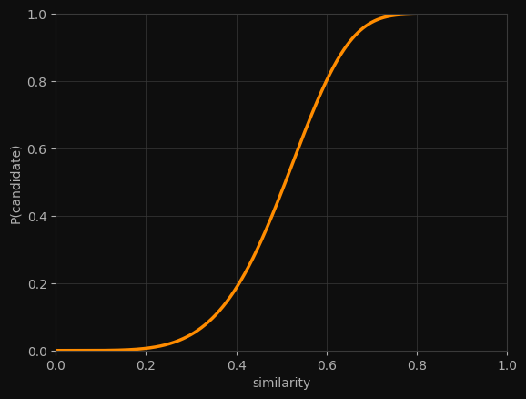

Close Encounters of the LSH Kind
################################
:date: 2024-05-11 21:45
:tags: algorithm

Imagine you're building an antique shop, and need a signature verification tool. So you have a collection of signatures, each represented by a tuple of integers:

.. code-block:: python

    signatures = [
        (1, 45, 2, 5, 10),  # signature 0
        (1, 17, 2, 5, 10),  # similar to signature 0
        (8, 99, 3, 7, 42),  # different
        (1, 45, 2, 5, 11),  # similar to signature 0
        # ...
        # ...
        # ...
    ]

Two signatures are *similar* if most of their positions match. You want to find all similar pairs.

The brute-force approach is O(N²) comparisons. For 10,000 items, that's ~50 million comparisons. For a million items, 500 billion. Can we do better?

Hash, baby, hash
****************

Your first instinct might be: "Hash tables! I'll hash each signature and group identical ones."

.. code-block:: python

    matches = defaultdict(list)
    for idx, signature in enumerate(signatures):
        matches[signature].append(idx)      # uses hash(signature) as a key

This finds exact duplicates instantly. But we don't want exact matches — we want *similar* matches. And regular hash functions are designed to do the opposite of what we need:

.. code-block:: python

    sig_a = (1, 2, 3, 4, 5)
    sig_b = (1, 2, 3, 4, 6)  # differs by just one position!
    
    print(hash(sig_a))       # -5659871693760987716
    print(hash(sig_b))       # 847769062341010709    <- completely different!

One tiny change, and the hash is unrecognisable. Similar signatures scatter across different buckets. We need a hash that keeps similar things together.

Divide and conquer
******************

But what if, instead of hashing the *whole* signature, we would hash just parts of it?

.. code-block:: python

    signature = (1, 2, 3, 4, 5, 6, 7, 8, 9, 10, 11, 12)

    # Split into 4 buckets of 3 values each
    buckets = [
        tuple(signature[0:3]),   # (1, 2, 3)
        tuple(signature[3:6]),   # (4, 5, 6)
        tuple(signature[6:9]),   # (7, 8, 9)
        tuple(signature[9:12]),  # (10, 11, 12)
    ]

Now let's see what happens with two similar signatures:

.. code-block:: python

    sig_a = (1, 2, 3,  4, 5, 6,  7, 8, 9,  10, 11, 12)
    sig_b = (1, 2, 3,  4, 5, 0,  7, 0, 9,  10, 11, 12)
    #                     ^         ^  different positions
    
    buckets_a = [(1,2,3), (4,5,6), (7,8,9), (10,11,12)]
    buckets_b = [(1,2,3), (4,5,0), (7,0,9), (10,11,12)]
    #            ^^^^^^^                    ^^^^^^^^^^^ 
    #             match!                       match!

Even though the signatures differ in two positions, they have *identical buckets* at positions 0 and 3. If we hash each bucket separately, these signatures will collide in at least two hash tables.

That's the core of `Locality-Sensitive Hashing <https://en.wikipedia.org/wiki/Locality-sensitive_hashing>`_: split signatures into buckets, hash each bucket into its own table, and call two items "candidates" if they collide in *any* bucket.

Locality-sensitive hashing
**************************

Let's build this step by step. First, splitting signatures into buckets:

.. code-block:: python

    def split_into_buckets(signature, num_buckets):
        bucket_size = len(signature) // num_buckets
        return [
            tuple(signature[i * bucket_size : (i + 1) * bucket_size])
            for i in range(num_buckets)
        ]

    sig = (1, 2, 3, 4, 5, 6, 7, 8, 9, 10, 11, 12)
    print(split_into_buckets(sig, 4))
    # [(1, 2, 3), (4, 5, 6), (7, 8, 9), (10, 11, 12)]

Now we build one hash table per bucket. Each table maps a bucket's hash to the set of item IDs that have that bucket:

.. code-block:: python

    def build_index(signatures, num_buckets):
        # one hash table per bucket
        index = [defaultdict(set) for _ in range(num_buckets)]
        
        for sig_idx, sig in enumerate(signatures):
            buckets = split_into_buckets(sig, num_buckets)
            for bucket_idx, bucket in enumerate(buckets):
                index[bucket_idx][bucket].add(sig_idx)
        
        return index

And to find candidates for a query signature, we check all buckets:

.. code-block:: python

    def find_candidates(index, query_sig, num_buckets):
        candidates = set()
        buckets = split_into_buckets(query_sig, num_buckets)
        
        for bucket_idx, bucket in enumerate(buckets):
            candidates.update(index[bucket_idx][bucket])
        
        return candidates

Let's see it work:

.. code-block:: python

    signatures = [
        (1, 2, 3, 4, 5, 6, 7, 8),   # item 0
        (1, 2, 3, 4, 5, 6, 0, 0),   # item 1 - similar to 0
        (9, 9, 9, 9, 9, 9, 9, 9),   # item 2 - different
    ]
    
    index = build_index(signatures, num_buckets=4)
    candidates = find_candidates(index, signatures[0], num_buckets=4)
    print(candidates)               # {0, 1} - found the similar one!

But Why Does This Work?
***********************

Let's think about when two signatures collide in a bucket. They collide only if *every* position in that bucket matches. If a bucket has 3 positions, all 3 must match.

So, what's the probability of that happening?

Say two signatures have similarity **s** — meaning about a fraction **s** of their positions match. If we pick one position, there's probability **s** that it matches. For the whole bucket to match, we need *all* positions to match:

.. math::
     P_{bucket\,match}  = 0.8^3 = 0.512

With 80% similarity and buckets of size 3, there's about a 51% chance any given bucket matches.

Now, for two items to become candidates, they need to match in *at least one* bucket. The easiest way to compute this is to flip it: what's the probability they match in *no* buckets?

.. code-block:: python

    s = 0.8  # similarity
    r = 3    # rows per bucket
    b = 4    # number of buckets

.. math::
     P_{bucket\,match} = s^r

     P_{no\,match} = (1 - P_{bucket\,match})^b

     P_{candidate} = 1 - P_{no\,match} = 1 - (1 - 0.512)^4 \approx 0.943

Two items with 80% similarity have a 94% chance of becoming candidates. Not bad!

The S-curve
***********

Let's see how this probability changes with similarity:

.. code-block:: python

    def p_candidate(similarity, num_buckets, rows_per_bucket):
        return 1 - (1 - similarity ** rows_per_bucket) ** num_buckets

    # With 20 buckets of 5 rows each (100 total signature length)
    b, r = 20, 5

    for s in [0.2, 0.3, 0.4, 0.5, 0.6, 0.7, 0.8, 0.9]:
        p = p_candidate(s, b, r)
        bar = "█" * int(p * 50)
        print(f"sim={s}: {p:.3f} {bar}")

Output:

.. code-block:: text

    sim=0.2: 0.006 
    sim=0.3: 0.047 ██
    sim=0.4: 0.186 █████████
    sim=0.5: 0.470 ███████████████████████
    sim=0.6: 0.802 ████████████████████████████████████████
    sim=0.7: 0.975 ████████████████████████████████████████████████
    sim=0.8: 1.000 █████████████████████████████████████████████████
    sim=0.9: 1.000 ██████████████████████████████████████████████████

See the shape? There's a sharp transition around 0.5. Below it, pairs rarely become candidates. Above it, they almost always do. This is the **S-curve** — a soft filter that lets similar pairs through and blocks dissimilar ones.

Tuning the Filter
*****************

You can move the threshold by adjusting **b** and **r**:

.. code-block:: text

    threshold ~0.1 (b=50, r=2):
      sim=0.3: 0.991
      sim=0.5: 1.000
      sim=0.8: 1.000
    
    threshold ~0.5 (b=20, r=5):
      sim=0.3: 0.047
      sim=0.5: 0.470
      sim=0.8: 1.000
    
    threshold ~0.8 (b=10, r=10):
      sim=0.3: 0.000
      sim=0.5: 0.010
      sim=0.8: 0.679

The pattern:

- **More buckets (b)** → lower threshold, catches more pairs (but more false positives)
- **More rows per bucket (r)** → higher threshold, stricter filter (but might miss similar pairs)

.. The approximate threshold sits at (1/b)\ :sup:`1/r`. For b=20, r=5: that's about 0.55.

The approximate threshold sits at:

..  math::
     {({\frac{1}{b}})}^\frac{1}{r}

For b = 20, r = 5 that's about 0.55

Putting It Together
*******************

The full pipeline has three steps:

1. **Build matches**: Hash all signatures into bucketed tables
2. **Find candidates**: For each signature, collect items that share any bucket
3. **Verify**: Compute actual similarity for candidates, keep those above threshold

That last step is important. LSH gives you *candidates*, not guarantees. Some dissimilar pairs will slip through (false positives) — the verification catches them. Some similar pairs might be missed (false negatives) — tuning **b** and **r** controls this tradeoff.

.. code-block:: python

    def find_similar_pairs(signatures, num_buckets, threshold):
        index = build_index(signatures, num_buckets)
        
        candidate_pairs = set()
        for i, sig in enumerate(signatures):
            for j in find_candidates(index, sig, num_buckets):
                if i < j:  # avoid duplicates and self-matches
                    candidate_pairs.add((i, j))
        
        # Verify candidates
        results = []
        for i, j in candidate_pairs:
            # Count matching positions
            matches = sum(a == b for a, b in zip(signatures[i], signatures[j]))
            similarity = matches / len(signatures[i])
            if similarity >= threshold:
                results.append((i, j, similarity))
        
        return results

How Much Faster?
****************

Let's compare. With 10,000 items:

- **Brute force**: 50 million comparisons
- **LSH**: ~10,000 × 20 = 200,000 bucket lookups, plus verifying maybe a few thousand candidates

That's orders of magnitude less work. And it scales beautifully — the number of candidates depends on how many truly similar pairs exist, not on the total number of items.

Conclusion
**********

LSH is one of those algorithms that feels like cheating. You're trading a small chance of missing similar pairs for a massive speedup. In most applications, that's exactly the right trade.

The next time you see "similar items" appear instantly on a site with millions of products, there's a good chance LSH is working behind the scenes — a hash function that learned to keep similar things together.